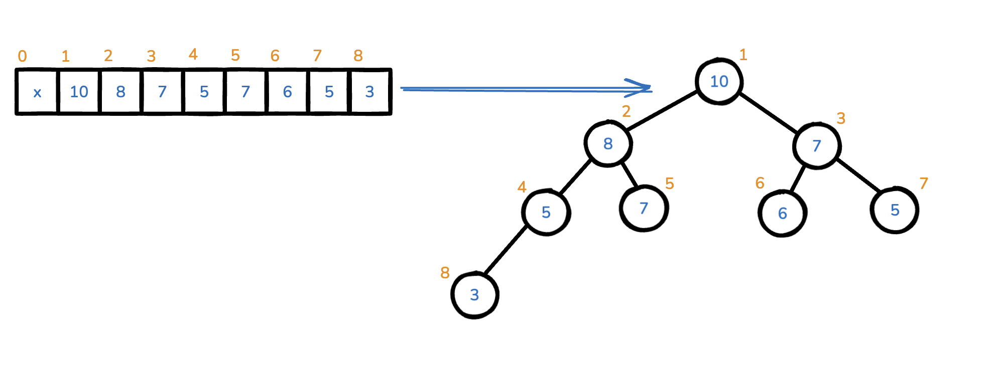
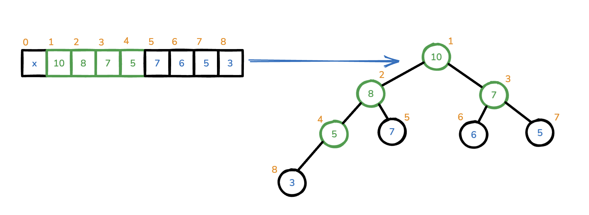
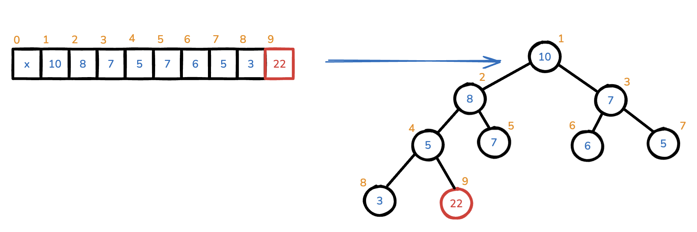
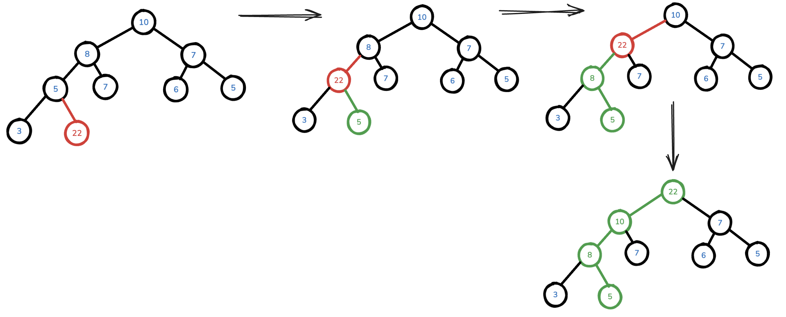
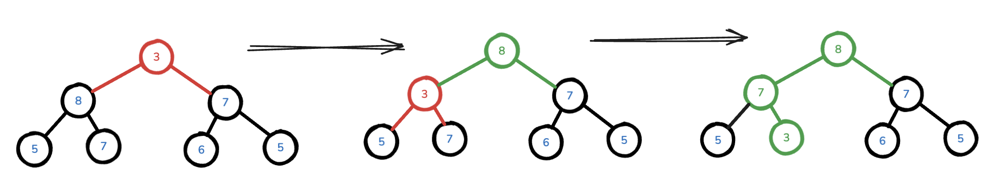

# Binary Heap

Implementation is based on list (which represents binary tree).

* [Code for Max Binary Heap](./max_heap.py)

There is a core lib in Python: [heapq](https://docs.python.org/3/library/heapq.html).

## Algorithm Complexity

<ins>Time</ins>:

* Building: `O(N)`. [Details](https://www.cs.umd.edu/~meesh/351/mount/lectures/lect14-heapsort-analysis-part.pdf).
* Fetching min/max: `O(1)`
* Extracting min/max: `O(log N)`

<ins>Memory</ins>: 
* `O(N)`

## Implementation Details

### Heap structure

Heap data can be stored in the list. The first heap item should be stored in the 1st index position.

Heap also can be represented as a Binary Tree with the height `log(n)`.

Then the item under index `i` has:

* children under indices: `2*i` and `2*i + 1`;
* parent item under the index: `[i / 2]`;
* leaves are starting from `N / 2`, where `N` $-$ is amount of items in the Heap. 

### Building a heap from the input array

1. Go through all available parents (from deepest to the root):
   * Execute [Heapify operation](#heapify-operation) for the current item

### Adding new item into the heap

1. Add new item in the end of the source list.
2. Execute [Sift Up operation](#sift-up-operation)

### Sift Up operation

The idea is simple: go through parent indices until the proper position is find.

### Heapify operation

This is a recursive operation which selects max/min item (depends on heap type) between parent, left/right children and
if parent item still is not on valid position, then run the same logic for selected child position.

