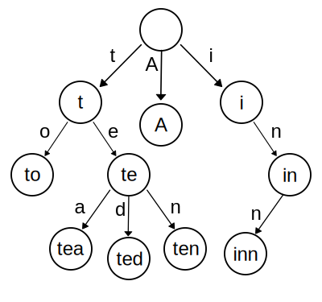
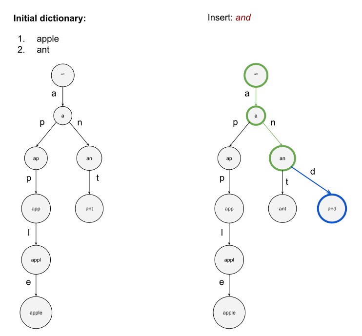
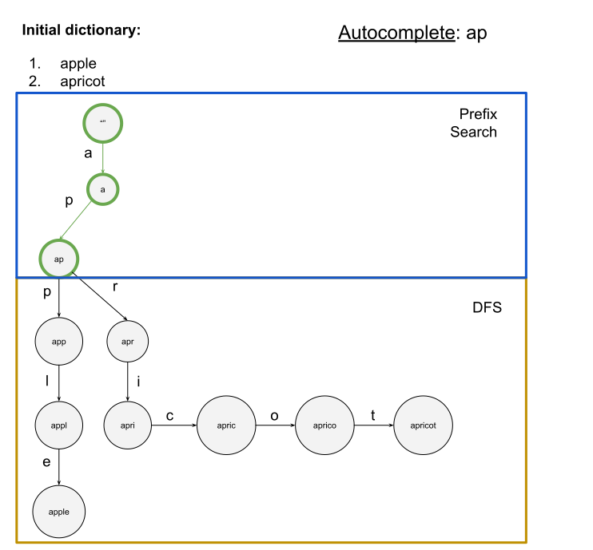

# Trie

Specialized search tree data structure used to store and re<ins>trie</ins>ve strings from a dictionary or set.

A Trie for the following keys: "A", "to", "tea", "ted", "ten", "i", "in", "inn".

    

* [Implementation](./main.py)

## Algorithm Complexity

* `N` - size of keys dictionary.
* `P` - the length of the key (prefix).
* `L` - is the total number of characters in all words that match the given prefix.

<ins>Time</ins>:

* [Building](#building): `O(total-chracters(N))`
* [Insert operation](#insert): `O(P)`
* [Search operation](#search): `O(P)`
* [Autocomplete search](#autocomplete): `O(P + L)`

<ins>Memory</ins>: 
* Overall tree: `O(total-characters(N))`

## Implementation details

### Building

A Trie can be presented as a prefix tree.

Every node keeps information about edges (by dedicated "symbol") and prefix
starting from the root to this node.

To build this structure from the predefined dictionary, it's necessary for each key (word):
1. Iterate through dictionary's keys (words).
2. [Insert](#insert) this word.

### Insert

1. Iterate through symbols (word's letters).
2. Follow the available edge or create a new node, and its corresponding edge if it does not exist.

    

### Search

1. Iterate through symbols (word's letters).
2. Follow the existing edge for the given "symbol".
3. If it's not possible to find the edge, then the prefix/word doesn't exist in the Trie.

### Autocomplete

1. [Search](#search) by passed prefix.
2. Then, find all available words by traversing the subtree using DFS.

    

